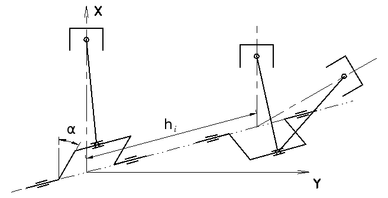
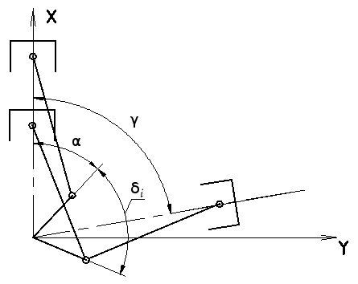

# Calculation of the dynamic balance of reciprocating and rotating masses of internal combustion engines

## Motivation
**balance.py** is designed to calculate the dynamic balance of reciprocating and rotating masses of internal combustion engines.

This tool is a Python revision of a program created in 1978 for a graduation project at the Belarusian Polytechnic Institute.
The original program was written in "ap" ("ап") language for computer "NAIRI-2".

## Theory

### Proections of Primary Reciprocating Forces:
$$
\sum P_{rcp1}(x)=m_{rcp}R\omega^2\left(\sum_{i=1}^{n_{left}}cos(\alpha+\delta_i)+cos\gamma\sum_{i=1}^{n_{right}}cos(\alpha+\delta_i-\gamma)\right)
$$

$$
\sum P_{rcp1}(y)=m_{rcp}R\omega^2\sin\gamma\sum_{i=1}^{n_{right}}cos(\alpha+\delta_i-\gamma)
$$

### Resulting Primary Reciprocating Force:
$$
\sum P_{rcp1}=\sqrt{\left(\sum P_{rcp1}(x)\right)^2+\left(\sum P_{rcp1}(y)\right)^2}
$$

### Proections of Secondary Reciprocating Forces:
$$
\sum P_{rcp2}(x)=m_{rcp}R\omega^2\lambda\left(\sum_{i=1}^{n_{left}}cos2(\alpha+\delta_i)+cos\gamma\sum_{i=1}^{n_{right}}cos2(\alpha+\delta_i-\gamma) \right)
$$

$$
\sum P_{rcp2}(y)=m_{rcp}R\omega^2\lambda\sin\gamma\sum_{i=1}^{n_{right}}cos2(\alpha+\delta_i-\gamma)
$$

### Resulting Secondary Reciprocating Force:
$$
\sum P_{rcp2}=\sqrt{\left(\sum P_{rcp2}(x)\right)^2+\left(\sum P_{rcp2}(y)\right)^2}
$$

### Proections of Centrifugal Forces:
$$
\sum K_{rot}(x)=m_{rot}R\omega^2\sum_{i=1}^{n_{cr}}cos(\alpha+\delta_i)
$$

$$
\sum K_{rot}(y)=m_{rot}R\omega^2\sum_{i=1}^{n_{cr}}sin(\alpha+\delta_i)
$$

### Resulting Centrifugal Force:
$$
\sum K_{rot}=\sqrt{\left(\sum K_{rot}(x)\right)^2+\left(\sum K_{rot}(y)\right)^2}
$$

### Proections of Primary Reciprocating Moments:
$$
\sum M_{rcp1}(x)=-m_{rcp}R\omega^2\sin\gamma\sum_{i=1}^{n_{right}}h_{iright}cos(\alpha+\delta_i-\gamma)
$$

$$
\sum M_{rcp1}(y)=m_{rcp}R\omega^2\left(\sum_{i=1}^{n_{left}}h_{ileft}cos(\alpha+\delta_i)+cos\gamma\sum_{i=1}^{n_{right}}h_{iright}cos(\alpha+\delta_i-\gamma)\right)
$$

### Resulting Primary Reciprocating Moment:
$$
\sum M_{rcp1}=\sqrt{\left(\sum M_{rcp1}(x)\right)^2+\left(\sum M_{rcp1}(y)\right)^2}
$$

### Proections of Secondary Reciprocating Moments:
$$
\sum M_{rcp2}(x)=-m_{rcp}R\omega^2\lambda\sin\gamma\sum_{i=1}^{n_{right}}h_{iright}cos2(\alpha+\delta_i-\gamma)
$$

$$
\sum M_{rcp2}(y)=m_{rcp}R\omega^2\lambda\left(\sum_{i=1}^{n_{left}}h_{ileft}cos2(\alpha+\delta_i)+cos\gamma\sum_{i=1}^{n_{right}}h_{iright}cos2(\alpha+\delta_i-\gamma)\right)
$$

### Resulting Secondary Reciprocating Moment:
$$
\sum M_{rcp2}=\sqrt{\left(\sum M_{rcp2}(x)\right)^2+\left(\sum M_{rcp2}(y)\right)^2}
$$

### Proections of Centrifugal Moments:
$$
\sum M_{rot}(x)=-m_{rot}R\omega^2\sum_{i=1}^{n_{cr}}h_{i}sin(\alpha+\delta_i)
$$

$$
\sum M_{rot}(y)=m_{rot}R\omega^2\sum_{i=1}^{n_{cr}}h_{i}cos(\alpha+\delta_i)
$$

### Resulting Centrifugal Moment:
$$
\sum M_{rot}=\sqrt{\left(\sum M_{rot}(x)\right)^2+\left(\sum M_{rot}(y)\right)^2}
$$

---

Fig. 1

Fig. 2

<!---
-->

### Abbreviations

**The following abbreviations are used:**

\(m_{rcp}\) — mass of reciprocating parts, kg

\(m_{rot}\) — mass of rotating parts, kg

\(L\) — connecting rod length, m

\(R\) — crank radius, m

\(\lambda=L/R\) — elongation ratio, equal to the ratio
of the connection rod length L to the crank radius R

\(\omega\) — angular velocity, crankshaft rotational speed (\(\omega=\frac{2\pi N}{60}\)), \(s^{-1}\)

\(\alpha\) — the crank-angle with respect to the x-axis, grad

\(\delta_{i}\) — angle between first crankpin and subsequent ones on the crankshaft, grad

\(\gamma\) — angle between the two banks of cylinders (V - angle), grad

\(h_{i}\) — the pitch distances between the first connecting rod and subsequent ones on the crankshaft journals, m

---
### References

1. Železko B.E. Osnovy teorii i dinamika avtomobilnych i traktornych dvigatelej. / Железко Б.Е. Основы теории и динамика автомобильных и тракторных двигателей.
Minsk : Vysšaja škola, 1980 / Мн. : Выш. школа, 1980.

2. Alberto Dagna , Cristiana Delprete, Chiara Gastaldi. A General Framework for Crankshaft Balancing and
Counterweight Design. Department of Mechanical and Aerospace Engineering, Politecnico di Torino. Appl. Sci. 2021, 11(19), 8997; https://doi.org/10.3390/app11198997.
